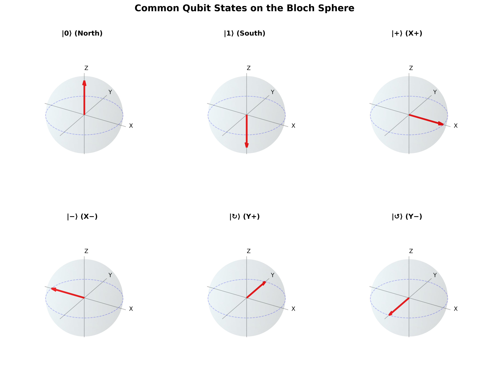

# Part 1: Foundations - Illustrations Plan

**Created:** November 6, 2025
**Status:** Planning Phase
**Total Illustrations Needed:** 23

---

## Priority System

- 🔴 **CRITICAL** - Essential for understanding core concepts
- 🟡 **HIGH** - Significantly improves comprehension
- 🟢 **MEDIUM** - Nice to have, enhances learning
- ⚪ **LOW** - Optional, supplementary

---

## A. Qiskit-Generated Visualizations (16 illustrations)

### 🔴 CRITICAL (Must create first)

#### 1. Basic Bloch Sphere with Common States
**File:** `01-foundations/illustrations/bloch-sphere-basic.png`
**Referenced in:** 04-the-qubit.md (lines 86-200)
**Description:**
- Empty Bloch sphere showing axes (X, Y, Z)
- Mark key states:
  - |0⟩ at north pole
  - |1⟩ at south pole
  - |+⟩, |−⟩ on equator (X-axis)
  - |↻⟩, |↺⟩ on equator (Y-axis)
- Labels for all states
- Show θ and φ angles

**Qiskit code:**
```python
from qiskit.visualization import plot_bloch_vector
from qiskit.quantum_info import Statevector
```

#### 2. Bell State Creation Circuit
**File:** `01-foundations/illustrations/bell-state-circuit.png`
**Referenced in:** 05-entanglement.md (line 144)
**Description:**
- Circuit showing H + CNOT
- Input: |00⟩
- Output: |Φ⁺⟩ = (|00⟩ + |11⟩)/√2
- Step-by-step state labels

**Qiskit code:**
```python
from qiskit import QuantumCircuit
qc = QuantumCircuit(2)
qc.h(0)
qc.cx(0, 1)
qc.draw('mpl')
```

#### 3. Single Qubit Gates on Bloch Sphere
**File:** `01-foundations/illustrations/gates-bloch-sphere.png`
**Referenced in:** 04-the-qubit.md (lines 500-600)
**Description:**
- Show X, Y, Z gate effects as rotations
- Before/after states
- Rotation arrows
- 6 subfigures (2 per gate: before & after)

**Qiskit code:**
```python
# Multiple Bloch spheres showing gate effects
```

#### 4. Superposition State Evolution
**File:** `01-foundations/illustrations/superposition-evolution.png`
**Referenced in:** 03-quantum-mechanics-basics.md (lines 150-250)
**Description:**
- Start: |0⟩ state
- Apply H gate: |+⟩ = (|0⟩ + |1⟩)/√2
- Show on Bloch sphere
- Measurement outcomes (histogram)

**Qiskit code:**
```python
# Bloch sphere + measurement histogram
```

---

### 🟡 HIGH PRIORITY

#### 5. Measurement in Different Bases
**File:** `01-foundations/illustrations/measurement-bases.png`
**Referenced in:** 06-measurement.md (lines 150-300)
**Description:**
- Three subfigures:
  - Z-basis measurement (computational)
  - X-basis measurement (Hadamard)
  - Y-basis measurement
- Show circuits for each
- Show state |+⟩ measured in each basis

**Qiskit code:**
```python
# Three circuits with different measurement basis changes
```

#### 6. Pauli Gate Operations
**File:** `01-foundations/illustrations/pauli-gates.png`
**Referenced in:** 04-the-qubit.md (lines 500-550)
**Description:**
- 3x2 grid showing X, Y, Z gates
- Each row: Circuit diagram + matrix + Bloch sphere effect
- Input state |0⟩ for all

**Qiskit code:**
```python
# Grid of circuits and visualizations
```

#### 7. Hadamard Gate Effect
**File:** `01-foundations/illustrations/hadamard-gate.png`
**Referenced in:** 04-the-qubit.md (line 580)
**Description:**
- Show H gate creating superposition
- |0⟩ → |+⟩
- |1⟩ → |−⟩
- Bloch sphere visualization
- Probability histograms

**Qiskit code:**
```python
# H gate visualization
```

#### 8. All Four Bell States
**File:** `01-foundations/illustrations/four-bell-states.png`
**Referenced in:** 05-entanglement.md (lines 50-100)
**Description:**
- 2x2 grid
- Each cell: Bell state equation + circuit to create it
- |Φ⁺⟩, |Φ⁻⟩, |Ψ⁺⟩, |Ψ⁻⟩

**Qiskit code:**
```python
# Four circuits showing Bell state preparation
```

#### 9. Entanglement Circuit Examples
**File:** `01-foundations/illustrations/entanglement-examples.png`
**Referenced in:** 05-entanglement.md (lines 200-300)
**Description:**
- GHZ state circuit: (|000⟩ + |111⟩)/√2
- W state circuit: (|001⟩ + |010⟩ + |100⟩)/√3
- Show 3-qubit circuits

**Qiskit code:**
```python
# Multi-qubit entanglement circuits
```

---

### 🟢 MEDIUM PRIORITY

#### 10. Phase Gates (S and T)
**File:** `01-foundations/illustrations/phase-gates.png`
**Referenced in:** 04-the-qubit.md (lines 600-650)
**Description:**
- S gate and T gate
- Bloch sphere rotations around Z-axis
- Show π/2 and π/4 rotations

**Qiskit code:**
```python
# S and T gate Bloch sphere visualizations
```

#### 11. Quantum Teleportation Circuit
**File:** `01-foundations/illustrations/teleportation-circuit.png`
**Referenced in:** 05-entanglement.md (lines 400-450)
**Description:**
- Complete quantum teleportation protocol
- 3 qubits
- Bell state preparation
- Bell measurement
- Conditional corrections

**Qiskit code:**
```python
# Full teleportation circuit with measurements
```

#### 12. Superdense Coding Circuit
**File:** `01-foundations/illustrations/superdense-coding.png`
**Referenced in:** 05-entanglement.md (lines 450-500)
**Description:**
- Show 4 variants (00, 01, 10, 11)
- Different gates applied
- Bell measurement at end

**Qiskit code:**
```python
# Four circuits for superdense coding
```

#### 13. Measurement Collapse Visualization
**File:** `01-foundations/illustrations/measurement-collapse.png`
**Referenced in:** 06-measurement.md (lines 50-100)
**Description:**
- Before: Superposition on Bloch sphere
- During: Measurement process
- After: Collapsed to |0⟩ or |1⟩
- Show probabilistic outcomes

**Qiskit code:**
```python
# Multiple Bloch spheres showing collapse
```

#### 14. State Tomography Process
**File:** `01-foundations/illustrations/state-tomography.png`
**Referenced in:** 06-measurement.md (lines 500-600)
**Description:**
- Unknown state |ψ⟩
- Measure in X, Y, Z bases
- Reconstruct Bloch vector
- Show 3 measurement circuits

**Qiskit code:**
```python
# Tomography circuits and reconstruction
```

#### 15. CNOT Truth Table and Circuit
**File:** `01-foundations/illustrations/cnot-gate.png`
**Referenced in:** 05-entanglement.md (line 140)
**Description:**
- CNOT gate symbol
- Truth table
- Matrix representation
- Example with |00⟩, |01⟩, |10⟩, |11⟩

**Qiskit code:**
```python
# CNOT gate visualization
```

#### 16. Multi-qubit Measurement Outcomes
**File:** `01-foundations/illustrations/multi-qubit-measurement.png`
**Referenced in:** 06-measurement.md (lines 100-150)
**Description:**
- 2-qubit entangled state
- Measurement histogram showing correlations
- For |Φ⁺⟩: Only |00⟩ and |11⟩ outcomes

**Qiskit code:**
```python
# Histogram of measurement results
```

---

## B. Custom Python/Matplotlib Visualizations (5 illustrations)

### 🔴 CRITICAL

#### 17. Bit vs Qubit Comparison
**File:** `01-foundations/illustrations/bit-vs-qubit.png`
**Referenced in:** 02-classical-recap.md, 04-the-qubit.md
**Description:**
- Side-by-side comparison
- Classical bit: Coin (heads/tails)
- Qubit: Bloch sphere showing superposition
- Key differences table

**Tools:** Matplotlib + custom drawing

#### 18. Wave-Particle Duality
**File:** `01-foundations/illustrations/wave-particle-duality.png`
**Referenced in:** 03-quantum-mechanics-basics.md (lines 50-100)
**Description:**
- Photon/electron showing both behaviors
- Wave interference pattern
- Particle detection points
- Simple schematic

**Tools:** Matplotlib

---

### 🟡 HIGH PRIORITY

#### 19. Double-Slit Experiment
**File:** `01-foundations/illustrations/double-slit.png`
**Referenced in:** 03-quantum-mechanics-basics.md (lines 100-150)
**Description:**
- Source → Barrier with 2 slits → Screen
- Show interference pattern
- Compare: Classical (no interference) vs Quantum (interference)

**Tools:** Matplotlib

#### 20. Classical Gate Symbols
**File:** `01-foundations/illustrations/classical-gates.png`
**Referenced in:** 02-classical-recap.md (lines 100-200)
**Description:**
- Logic gate symbols: AND, OR, NOT, XOR, NAND
- Truth tables for each
- Simple, clean circuit symbols

**Tools:** Matplotlib or draw.io

#### 21. De Broglie Wavelength Comparison
**File:** `01-foundations/illustrations/wavelength-comparison.png`
**Referenced in:** 03-quantum-mechanics-basics.md (lines 150-200)
**Description:**
- Size comparison chart
- Baseball vs electron wavelength
- Show why quantum effects matter at atomic scale
- Logarithmic scale visualization

**Tools:** Matplotlib

---

## C. Conceptual Diagrams (2 illustrations)

### 🟢 MEDIUM PRIORITY

#### 22. Decoherence Process
**File:** `01-foundations/illustrations/decoherence.png`
**Referenced in:** 03-quantum-mechanics-basics.md (lines 600-700)
**Description:**
- Qubit in superposition
- Environment interaction (photons, heat, etc.)
- Loss of quantum properties
- Timeline showing coherence decay

**Tools:** Draw.io or Inkscape (SVG)

#### 23. Quantum vs Classical Information Flow
**File:** `01-foundations/illustrations/quantum-classical-info.png`
**Referenced in:** 04-the-qubit.md, 06-measurement.md
**Description:**
- Flowchart showing:
  - Classical: n bits → n bits out
  - Quantum: n qubits (2ⁿ amplitudes) → n bits out
- Information bottleneck at measurement

**Tools:** Draw.io or Inkscape (SVG)

---

## Implementation Plan

### Phase 1: Critical Qiskit Visualizations (Priority 🔴)
**Estimated time:** 2-3 hours
**Count:** 4 illustrations

1. Basic Bloch Sphere (#1)
2. Bell State Creation Circuit (#2)
3. Single Qubit Gates on Bloch Sphere (#3)
4. Superposition State Evolution (#4)

### Phase 2: Critical Custom Visualizations (Priority 🔴)
**Estimated time:** 2 hours
**Count:** 2 illustrations

17. Bit vs Qubit Comparison
18. Wave-Particle Duality

### Phase 3: High Priority Qiskit (Priority 🟡)
**Estimated time:** 3-4 hours
**Count:** 5 illustrations

5-9 (Measurement bases, Pauli gates, Hadamard, Bell states, Entanglement)

### Phase 4: High Priority Custom (Priority 🟡)
**Estimated time:** 2-3 hours
**Count:** 3 illustrations

19-21 (Double-slit, Classical gates, Wavelength comparison)

### Phase 5: Medium Priority (Priority 🟢)
**Estimated time:** 4-5 hours
**Count:** 9 illustrations

Remaining Qiskit + conceptual diagrams

---

## Technical Specifications

### Image Format
- **Primary:** PNG (high resolution, 300 DPI)
- **Alternative:** SVG (for diagrams that need scaling)
- **Size:** Max 1920px wide, maintain aspect ratio

### Qiskit Settings
```python
# Standard settings for consistency
from qiskit.visualization import plot_bloch_vector, plot_histogram
import matplotlib.pyplot as plt

# Use 'mpl' (matplotlib) style for circuits
qc.draw('mpl', style='iqp', fold=False)

# High-quality export
plt.savefig('filename.png', dpi=300, bbox_inches='tight',
            facecolor='white', edgecolor='none')
```

### Color Scheme
- **Background:** White or transparent
- **Qubit 0 lines:** Blue (#1f77b4)
- **Qubit 1 lines:** Orange (#ff7f0e)
- **Bloch sphere:** Standard Qiskit colors
- **Text:** Black, minimum 10pt font

### File Naming Convention
```
{section}-{topic}-{description}.png

Examples:
- bloch-sphere-basic.png
- bell-state-circuit.png
- measurement-bases-xyz.png
```

---

## Integration with Content

### Markdown References

**Standard format:**
```markdown

*Figure X: Caption explaining the illustration*
```

**Example:**
```markdown

*Figure 1: The Bloch sphere showing the six most common qubit states.
|0⟩ and |1⟩ are at the poles, while |+⟩, |−⟩, |↻⟩, and |↺⟩ are on the equator.*
```

---

## Quality Checklist

For each illustration:
- [ ] High resolution (300 DPI for print)
- [ ] Clear labels (readable at 50% zoom)
- [ ] Consistent color scheme
- [ ] White/transparent background
- [ ] Proper file naming
- [ ] Added to git repository
- [ ] Referenced in markdown content
- [ ] Caption provided
- [ ] Alt text for accessibility

---

## Success Metrics

**Complete when:**
- All 23 illustrations created
- Integrated into markdown files
- Consistent visual style
- Peer reviewed for accuracy
- Accessible (alt text, captions)

**Priority for Part 1 launch:**
- Minimum: All 6 CRITICAL illustrations (🔴)
- Target: All CRITICAL + HIGH (12 total)
- Ideal: All 23 illustrations

---

## Notes

- Qiskit visualizations are preferred for quantum circuits and Bloch spheres (16/23 = 70%)
- Custom visualizations needed for classical concepts and conceptual diagrams
- Can generate most illustrations programmatically (good for consistency)
- SVG format preferred for diagrams that need editing later
- Consider creating a `generate_illustrations.py` script for reproducibility

---

**Next Steps:**
1. Create illustration generation script
2. Start with Phase 1 (4 critical Qiskit visualizations)
3. Review and integrate into markdown
4. Continue with remaining phases

---

*Last Updated: November 6, 2025*
